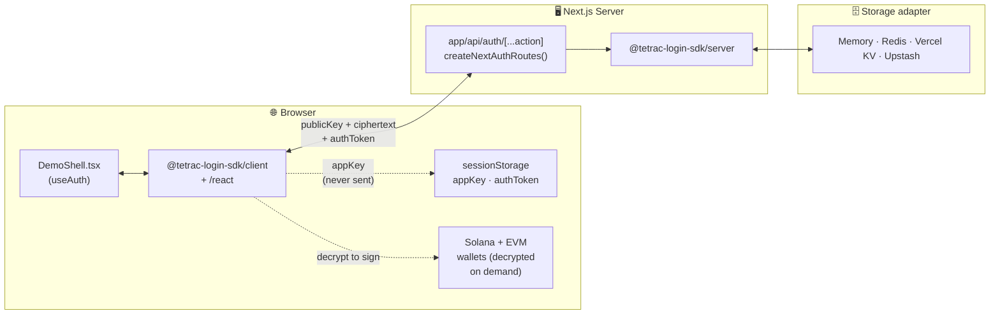
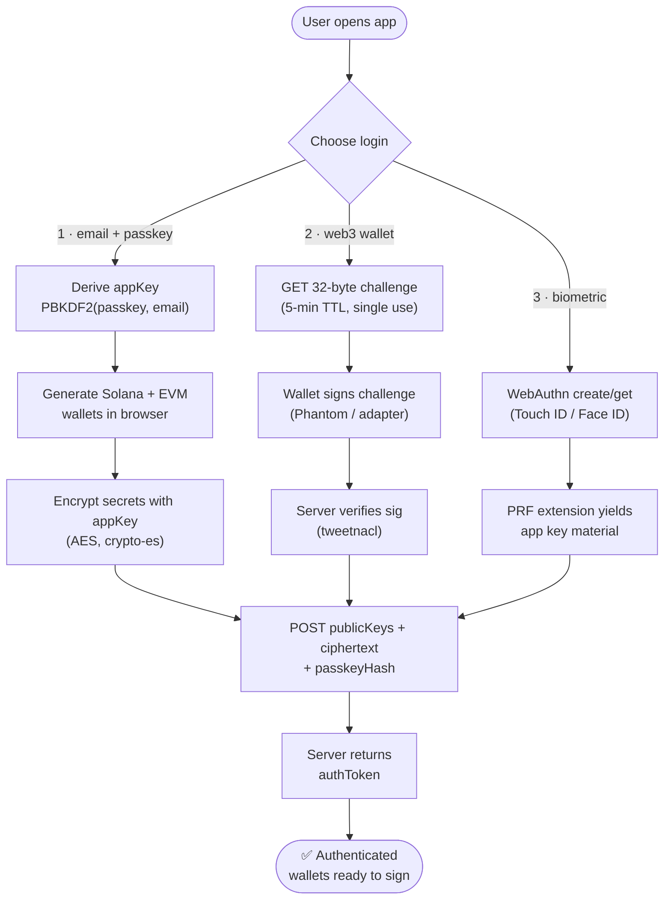

# next-ttc-login

[](https://nextjs.org/)
[](https://react.dev/)
[](https://www.typescriptlang.org/)
[](https://turbo.build/pack)
[](https://solana.com/)
[](https://viem.sh/)
[](https://www.w3.org/TR/webauthn-3/)
[](LICENSE)

A minimal **Next.js (App Router)** demo of [`@tetrac-login-sdk`](../tetrac-login-sdk) showing all three
login methods with **client-side, non-custodial wallet generation**:

1. **Email + passkey** — derives an app key, generates + encrypts Solana/EVM wallets in the browser.
2. **Web3 wallet** — challenge → sign → verify (uses an ephemeral in-browser keypair to stand in for Phantom).
3. **Biometric** — Touch ID / Face ID via WebAuthn PRF (needs a real authenticator).

## 📋 Table of Contents

- [Tech Stack](#-tech-stack)
- [Prerequisites](#-prerequisites)
- [Run](#-run)
- [Environment](#-environment)
- [Auth Flow](#-auth-flow)
- [How it's wired](#-how-its-wired)
- [Storage backends](#-storage-backends)
- [Troubleshooting](#-troubleshooting)
- [License](#-license)

## 🛠 Tech Stack

| Layer              | Tech                                                                                                                                            |
| ------------------ | ----------------------------------------------------------------------------------------------------------------------------------------------- |
| Framework          | [Next.js 16](https://nextjs.org/) (App Router, [Turbopack](https://turbo.build/pack))                                                           |
| Language           | [TypeScript 5](https://www.typescriptlang.org/)                                                                                                 |
| UI                 | [React 18](https://react.dev/)                                                                                                                  |
| Auth SDK           | [`@tetrac-login-sdk`](../tetrac-login-sdk) (local, linked via `file:`)                                                                          |
| Chains             | [@solana/web3.js](https://github.com/solana-labs/solana-web3.js), [viem](https://viem.sh/), [tweetnacl](https://github.com/dchest/tweetnacl-js) |
| Biometric          | [WebAuthn PRF](https://w3c.github.io/webauthn/#prf-extension)                                                                                   |
| Storage (optional) | [Redis](https://redis.io/) / [Vercel KV](https://vercel.com/storage/kv) / [Upstash](https://upstash.com/) — in-memory by default                |

## 📦 Prerequisites

- **Node.js** ≥ 18 (recommended: v20 LTS via [nvm](https://github.com/nvm-sh/nvm))
- **npm** (or yarn / pnpm — `npm` is what the lockfile is built against)
- The sibling SDK repo cloned next to this one — the demo links it via
  `"@tetrac-login-sdk": "file:../tetrac-login-sdk"`:
  ```
  TTC/
  ├── next-ttc-login/        ← this repo
  └── tetrac-login-sdk/         ← required sibling
  ```

## 🚀 Run

```bash
# 1. Build the SDK first — the consumer imports from its dist/.
cd ../tetrac-login-sdk && npm install && npm run build

# 2. Install the demo's deps (links @tetrac-login-sdk from ../tetrac-login-sdk).
cd ../next-ttc-login && npm install

# 3. Copy the env template (optional — zero config works out of the box).
cp .env.local.example .env.local

# 4. Start the dev server.
npm run dev          # http://localhost:3000
```

> While iterating on the SDK, run `npm run dev` (which is `tsup --watch`) in
> `../tetrac-login-sdk` in a separate terminal so the demo picks up SDK changes
> automatically. After significant SDK edits, `rm -rf .next` here once.

## 🔐 Environment

Zero config: the demo uses an **in-memory store** by default. `.env.local` is only
needed if you want a real storage backend.

```bash
cp .env.local.example .env.local
```

Then uncomment **one** of the following in `.env.local`:

```bash
# Local Redis
REDIS_URL=redis://localhost:6379

# Vercel KV
KV_REST_API_URL=...
KV_REST_API_TOKEN=...

# Upstash Redis (REST, edge-friendly)
UPSTASH_REDIS_REST_URL=...
UPSTASH_REDIS_REST_TOKEN=...
```

`resolveStorageAdapter()` auto-selects the adapter from these env vars. All three clients
ship with the demo (server-externalized, so only the configured one loads at runtime; none
reach the client bundle).

## 🔄 Auth Flow

Three login methods, **one shared outcome**: an app key derived in the browser,
a session token from the server, and a set of encrypted wallets the SDK can
decrypt locally for signing. The server never sees a private key or the app key.

### Where things live



### Three paths in, one session out



### Email + passkey — the canonical flow

The most interesting path: wallet generation, AES encryption, and the server
exchange all happen **before** any secret leaves the browser.

```mermaid
sequenceDiagram
  autonumber
  actor U as User
  participant B as Browser<br/>(@tetrac-login-sdk/client)
  participant S as Server<br/>(/api/auth)
  participant DB as Storage

  rect rgb(28,32,44)
  Note over U,DB: 🆕 Register
  U->>B: email + passkey
  B->>B: appKey = PBKDF2(passkey, email)
  B->>B: generate Solana + EVM wallets
  B->>B: AES-encrypt each secret with appKey
  B->>S: { email, passkeyHash, publicKeys, ciphertext }
  S->>DB: store record
  S-->>B: { authToken }
  B->>B: sessionStorage ← appKey + authToken
  end

  rect rgb(20,28,40)
  Note over U,DB: 🔓 Login (returning user)
  U->>B: email + passkey
  B->>S: GET /user-data?email=…
  S->>DB: lookup
  S-->>B: { passkeyHash, publicKeys, ciphertext }
  B->>B: hash(passkey) === passkeyHash ?
  B->>B: appKey = PBKDF2(passkey, email)
  B-->>U: ✅ authenticated
  end

  rect rgb(20,32,28)
  Note over U,B: ✍️ Sign a transaction
  U->>B: request to sign
  B->>B: withDecryptedKey(wallet, appKey, fn)
  Note right of B: decrypt only for the<br/>duration of fn, then drop
  B-->>U: signed tx
  end
```



> **The server never holds**: the passkey, the app key, or any private key.
> It only holds: the **hash** of the passkey, **public keys**, and **ciphertext**.
> All three login methods produce the same `appKey` deterministically, so wallets
> decrypt anywhere the user can authenticate.

## 🧩 How it's wired

| File                                                                     | Role                                                                                       |
| ------------------------------------------------------------------------ | ------------------------------------------------------------------------------------------ |
| [`app/api/auth/[...action]/route.ts`](app/api/auth/[...action]/route.ts) | All auth endpoints via `createNextAuthRoutes()`                                            |
| [`app/lib/storage.ts`](app/lib/storage.ts)                               | Storage adapter (memory by default, Redis/KV/Upstash by env)                               |
| [`app/providers.tsx`](app/providers.tsx)                                 | `<AuthProvider apiBaseUrl="/api/auth">`                                                    |
| [`app/components/DemoShell.tsx`](app/components/DemoShell.tsx)           | `useAuth()` driving the three flows + the post-login wallets panel with re-auth key reveal |
| [`next.config.mjs`](next.config.mjs)                                     | `turbopack.root` set so Turbopack can follow the SDK symlink                               |

Nothing here implements auth logic — it all comes from the SDK.

## 🗄 Storage backends

| Backend          | When                   | Setup                                                                       |
| ---------------- | ---------------------- | --------------------------------------------------------------------------- |
| Memory (default) | Local hacking, demos   | None — just `npm run dev`                                                   |
| Redis            | Realistic local dev    | `brew install redis && brew services start redis`, then set `REDIS_URL`     |
| Vercel KV        | Vercel production      | Set `KV_REST_API_URL` + `KV_REST_API_TOKEN` (auto-selected when `VERCEL=1`) |
| Upstash          | Edge / serverless prod | Set `UPSTASH_REDIS_REST_URL` + `UPSTASH_REDIS_REST_TOKEN`                   |

## 🩺 Troubleshooting

**`Module not found: Can't resolve '@tetrac-login-sdk/<subpath>'`**
The SDK is reached through a symlink to `../tetrac-login-sdk`, which is outside this project's
directory. Turbopack refuses to follow such symlinks unless `turbopack.root` covers both.
This is already configured in [`next.config.mjs`](next.config.mjs) — if you see this error,
make sure that file is intact and the sibling SDK exists at `../tetrac-login-sdk`.

**Edits to the SDK don't show up**
The consumer reads `../tetrac-login-sdk/dist/` — you need to rebuild it. Use `npm run dev`
inside the SDK for `tsup --watch`. Clear `.next` once if HMR gets confused.

**TypeScript errors only at build time**
The editor resolves SDK types from source; `next build` reads `dist/`. Make sure the SDK is
built (`npm run build` in `../tetrac-login-sdk`) before `npm run build` here.

## 📄 License

MIT
