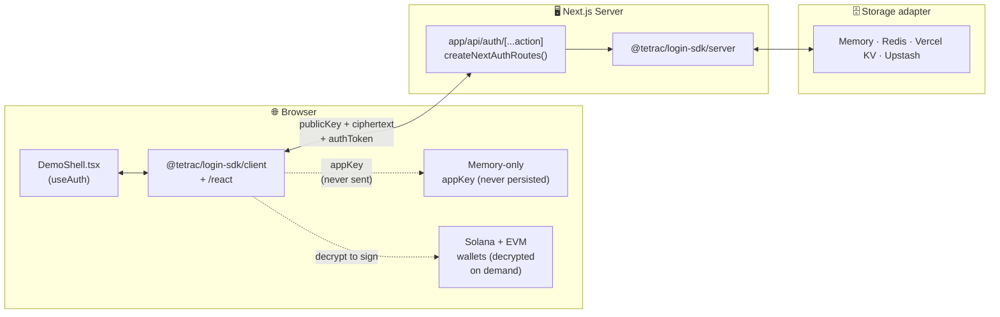
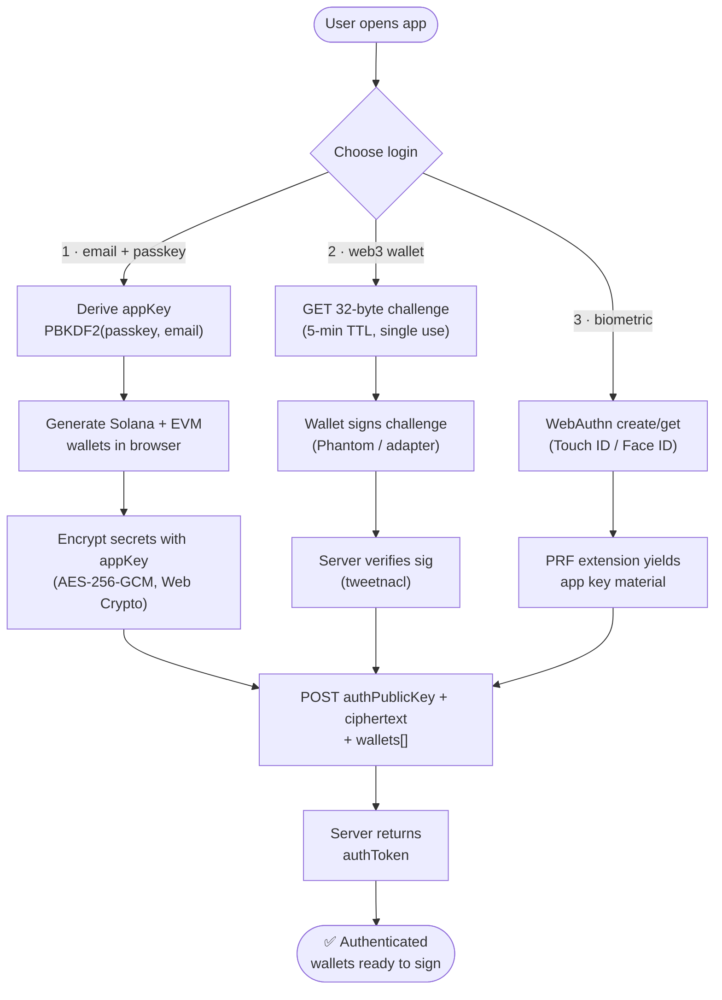

# next-ttc-login

[](https://nextjs.org/)
[](https://react.dev/)
[](https://www.typescriptlang.org/)
[](https://turbo.build/pack)
[](https://solana.com/)
[](https://viem.sh/)
[](https://www.w3.org/TR/webauthn-3/)
[](https://www.npmjs.com/package/@tetrac/login-sdk)
[](LICENSE)

A minimal **Next.js (App Router)** demo of [`@tetrac/login-sdk`](https://www.npmjs.com/package/@tetrac/login-sdk) showing all three
login methods with **client-side, non-custodial wallet generation**:

1. **Email + passkey** — derives an app key, generates + encrypts Solana/EVM wallets in the browser.
2. **Web3 wallet** — challenge → sign → verify (uses an ephemeral in-browser keypair to stand in for Phantom).
3. **Biometric** — Touch ID / Face ID via WebAuthn PRF (needs a real authenticator).

## 📋 Table of Contents

- [Tech Stack](#-tech-stack)
- [Prerequisites](#-prerequisites)
- [Run](#-run)
- [Environment](#-environment)
- [Auth Flow](#-auth-flow)
- [How it's wired](#-how-its-wired)
- [Storage backends](#-storage-backends)
  - [Wiping the store](#wiping-the-store-re-register-after-a-breaking-sdk-upgrade)
- [Hardening the host app](#-hardening-the-host-app)
- [Troubleshooting](#-troubleshooting)
- [License](#-license)

## 🛠 Tech Stack

| Layer              | Tech                                                                                                                                            |
| ------------------ | ----------------------------------------------------------------------------------------------------------------------------------------------- |
| Framework          | [Next.js 16](https://nextjs.org/) (App Router, [Turbopack](https://turbo.build/pack))                                                           |
| Language           | [TypeScript 5](https://www.typescriptlang.org/)                                                                                                 |
| UI                 | [React 18](https://react.dev/)                                                                                                                  |
| Auth SDK           | [`@tetrac/login-sdk`](https://www.npmjs.com/package/@tetrac/login-sdk) `0.3.0` (from npm)                                                       |
| Chains             | [@solana/web3.js](https://github.com/solana-labs/solana-web3.js), [viem](https://viem.sh/), [tweetnacl](https://github.com/dchest/tweetnacl-js) |
| Biometric          | [WebAuthn PRF](https://w3c.github.io/webauthn/#prf-extension)                                                                                   |
| Storage (optional) | [Redis](https://redis.io/) / [Vercel KV](https://vercel.com/storage/kv) / [Upstash](https://upstash.com/) — in-memory by default                |

## 📦 Prerequisites

- **Node.js** ≥ 18 (recommended: v20 LTS via [nvm](https://github.com/nvm-sh/nvm))
- **npm** (or yarn / pnpm — `npm` is what the lockfile is built against)

The SDK is a published package — [`@tetrac/login-sdk`](https://www.npmjs.com/package/@tetrac/login-sdk) —
pulled from npm on install. No sibling checkout required.

## 🚀 Run

```bash
# 1. Install dependencies (pulls @tetrac/login-sdk from npm).
npm install

# 2. Copy the env template (optional — zero config works out of the box).
cp .env.local.example .env.local

# 3. Start the dev server.
npm run dev          # http://localhost:3000
```

> To move to a newer SDK release, bump it with `npm install @tetrac/login-sdk@latest`,
> then clear `.next` once if HMR gets confused.

## 🔐 Environment

Zero config: the demo uses an **in-memory store** by default. `.env.local` is only
needed if you want a real storage backend.

```bash
cp .env.local.example .env.local
```

Then uncomment **one** of the following in `.env.local`:

```bash
# Local Redis
REDIS_URL=redis://localhost:6379

# Vercel KV
KV_REST_API_URL=...
KV_REST_API_TOKEN=...

# Upstash Redis (REST, edge-friendly)
UPSTASH_REDIS_REST_URL=...
UPSTASH_REDIS_REST_TOKEN=...
```

`resolveStorageAdapter()` auto-selects the adapter from these env vars. All three clients
ship with the demo (server-externalized, so only the configured one loads at runtime; none
reach the client bundle).

## 🔄 Auth Flow

Three login methods, **one shared outcome**: an app key derived in the browser,
a session token from the server, and a set of encrypted wallets the SDK can
decrypt locally for signing. The server never sees a private key or the app key.

### Where things live



### Three paths in, one session out



### Email + passkey — the canonical flow

The most interesting path: wallet generation, AES encryption, and the server
exchange all happen **before** any secret leaves the browser.

```mermaid
sequenceDiagram
  autonumber
  actor U as User
  participant B as Browser<br/>(@tetrac/login-sdk/client)
  participant S as Server<br/>(/api/auth)
  participant DB as Storage

  rect rgb(28,32,44)
  Note over U,DB: 🆕 Register
  U->>B: email + passkey
  B->>B: appKey = PBKDF2(passkey, email)
  B->>B: generate Solana + EVM wallets
  B->>B: AES-256-GCM encrypt each secret with appKey
  B->>S: { email, authPublicKey, wallets[], pbkdf2Iterations }
  S->>DB: store record
  S-->>B: { authToken }
  B->>B: memory ← appKey (never persisted)
  end

  rect rgb(20,28,40)
  Note over U,DB: 🔓 Login (returning user)
  U->>B: email + passkey
  B->>S: POST /challenge
  S-->>B: { challenge }
  B->>B: sign(challenge) with ed25519 auth key
  B->>S: POST /login { signature, challenge }
  S->>DB: verify signature against authPublicKey
  B->>B: appKey = PBKDF2(passkey, appId:email)
  B-->>U: ✅ authenticated
  end

  rect rgb(20,32,28)
  Note over U,B: ✍️ Sign a transaction
  U->>B: request to sign
  B->>B: withDecryptedKey(wallet, appKey, fn)
  Note right of B: decrypt only for the<br/>duration of fn, then drop
  B-->>U: signed tx
  end
```



> **The server never holds**: the passkey, the app key, or any private key.
> It holds **only public keys** (an ed25519 auth public key + wallet public keys) and ciphertext —
> no passkey-derived secret of any kind. Login is challenge → sign → verify.
> All three login methods produce the same `appKey` deterministically, so wallets
> decrypt anywhere the user can authenticate.

## 🧩 How it's wired

| File                                                                     | Role                                                                                       |
| ------------------------------------------------------------------------ | ------------------------------------------------------------------------------------------ |
| [`app/api/auth/[...action]/route.ts`](app/api/auth/[...action]/route.ts) | All auth endpoints via `createNextAuthRoutes()`                                            |
| [`app/lib/storage.ts`](app/lib/storage.ts)                               | Storage adapter (memory by default, Redis/KV/Upstash by env)                               |
| [`app/providers.tsx`](app/providers.tsx)                                 | `<AuthProvider apiBaseUrl="/api/auth">`                                                    |
| [`app/components/DemoShell.tsx`](app/components/DemoShell.tsx)           | `useAuth()` driving the three flows + the post-login wallets panel with re-auth key reveal |
| [`next.config.mjs`](next.config.mjs)                                     | Externalizes the optional storage backends so only the configured one loads server-side    |

Nothing here implements auth logic — it all comes from the SDK.

## 🗄 Storage backends

| Backend          | When                   | Setup                                                                       |
| ---------------- | ---------------------- | --------------------------------------------------------------------------- |
| Memory (default) | Local hacking, demos   | None — just `npm run dev`                                                   |
| Redis            | Realistic local dev    | `brew install redis && brew services start redis`, then set `REDIS_URL`     |
| Vercel KV        | Vercel production      | Set `KV_REST_API_URL` + `KV_REST_API_TOKEN` (auto-selected when `VERCEL=1`) |
| Upstash          | Edge / serverless prod | Set `UPSTASH_REDIS_REST_URL` + `UPSTASH_REDIS_REST_TOKEN`                   |

### Wiping the store (re-register after a breaking SDK upgrade)

After a breaking SDK release (e.g. `0.2.0 → 0.3.0`) old records must be flushed — there is no
migration path. Pick the command that matches your backend.

#### Memory adapter

Restart the dev server. The in-memory store is process-local and dies with the process.

```bash
# Ctrl-C the dev server, then:
npm run dev
```

#### Local Redis

If the database is **dedicated** to this app, flush the whole thing:

```bash
redis-cli FLUSHDB
```

If you share the Redis instance with other apps, delete only the auth keyspace:

```bash
redis-cli --scan --pattern 'pubKey:*'    | xargs -r redis-cli DEL
redis-cli --scan --pattern 'email:*'     | xargs -r redis-cli DEL
redis-cli --scan --pattern 'session:*'   | xargs -r redis-cli DEL
redis-cli --scan --pattern 'challenge:*' | xargs -r redis-cli DEL
redis-cli --scan --pattern 'ratelimit:*' | xargs -r redis-cli DEL
```

> On macOS, `xargs` needs `-r` replaced with nothing (BSD `xargs` has no `-r`):
> `redis-cli --scan --pattern 'pubKey:*' | xargs redis-cli DEL`

#### Upstash Redis (REST)

Use the Upstash REST API — no client install needed, just your env vars:

```bash
# Flush the entire database
curl -X POST "$UPSTASH_REDIS_REST_URL/flushdb" \
  -H "Authorization: Bearer $UPSTASH_REDIS_REST_TOKEN"
```

Or delete by key pattern (safe on a shared database):

```bash
for pattern in 'pubKey:*' 'email:*' 'session:*' 'challenge:*' 'ratelimit:*'; do
  # SCAN + DEL in a single pipeline
  curl -s "$UPSTASH_REDIS_REST_URL/scan/0/match/$pattern/count/1000" \
    -H "Authorization: Bearer $UPSTASH_REDIS_REST_TOKEN" \
    | jq -r '.result[1][]' \
    | while read key; do
        curl -s -X POST "$UPSTASH_REDIS_REST_URL/del/$key" \
          -H "Authorization: Bearer $UPSTASH_REDIS_REST_TOKEN" > /dev/null
      done
done
```

Alternatively, open the **Upstash console → your database → Data Browser** and click
**Flush Database** (the red button at the top-right).

#### Vercel KV (Upstash-backed)

```bash
# Install the Vercel CLI if you haven't already
npm i -g vercel

# Flush via the KV REST endpoint (same as Upstash above, different env vars)
curl -X POST "$KV_REST_API_URL/flushdb" \
  -H "Authorization: Bearer $KV_REST_API_TOKEN"
```

Or use the Vercel Dashboard → your project → **Storage → KV → CLI** tab and run `FLUSHDB`.

---

## 🛡 Hardening the host app

`@tetrac/login-sdk` is non-custodial and keeps the app/encryption key in **memory only** — but the
security of the keys ultimately rests on the page that loads it. A host app that ships an XSS hands an
attacker your origin. Treat the following as the minimum bar.

### 1. Ship a Content-Security-Policy

This repo's [`next.config.mjs`](./next.config.mjs) serves a strict CSP via `async headers()`:

- `default-src 'self'`, `script-src 'self'` — no inline/`eval` JS, no foreign script origins.
- `connect-src 'self'` — the SDK only ever calls the same-origin `/api/auth` route.
- `frame-ancestors 'none'`, `object-src 'none'`, `base-uri 'self'` — block clickjacking, plugins, `<base>` hijacking.
- `style-src 'self' 'unsafe-inline'` — **the one concession.** Next injects inline `<style>` during
  hydration and this app uses React `style={{…}}` props, both of which a strict `style-src` blocks.
  `'unsafe-inline'` on _styles_ can't execute JS; removing it needs nonce-based styling (non-trivial in
  Next). We deliberately do **not** put `'unsafe-inline'` on `script-src`.

Plus `X-Content-Type-Options: nosniff`, `Referrer-Policy: strict-origin-when-cross-origin`, and HSTS.

> **What CSP does and doesn't do.** CSP _contains_ an XSS — it stops injected script from loading foreign
> code, exfiltrating over the network, or framing the page. It does **not** _prevent_ the XSS. Keep
> encoding output and never trust input; CSP is the outer ring, not the only one.

### 2. Add Trusted Types (where supported)

Trusted Types neutralize DOM-XSS sinks (`innerHTML`, `script.src`, …). Layer it on top:

```
Content-Security-Policy: require-trusted-types-for 'script'; trusted-types default;
```

Roll out in report-only first (`Content-Security-Policy-Report-Only`). Chromium-only today — additive
hardening, not a cross-browser guarantee.

### 3. Pin third-party scripts with SRI

If you ever load a CDN script, add Subresource Integrity (`integrity="sha384-…" crossorigin`). The
cleanest posture is to self-host all JS (matching `script-src 'self'`) and avoid third-party `<script>`.

### 4. Keep `autoLockMs` short

The vault auto-locks after `autoLockMs` idle (SDK default **15s**; this demo relaxes it to 60s in
[`app/providers.tsx`](./app/providers.tsx) only for a smoother walkthrough). That window is how long a
decrypted key can sit in memory for an XSS to race against — in production prefer the SDK default or lower:

```tsx
<AuthProvider apiBaseUrl="/api/auth" config={{ appId: "myapp.example", autoLockMs: 15_000 }}>
```

Revealing a plaintext key always re-runs the auth ceremony regardless of the lock, and the key is never
written to `localStorage`/`sessionStorage` — only the non-secret session token, public key, and email.

### 5. Setup your appId
[app id in config](./app/lib/appConfig.ts)

## 🩺 Troubleshooting

**`Module not found: Can't resolve '@tetrac/login-sdk/<subpath>'`**
Reinstall dependencies (`rm -rf node_modules && npm install`) so the package and its
`exports` subpaths (`/client`, `/react`, `/next`, `/ui`, …) resolve. Confirm you're on
`@tetrac/login-sdk` ≥ 0.3.0 (`npm ls @tetrac/login-sdk`).

**Picking up a new SDK release**
Bump it with `npm install @tetrac/login-sdk@latest`, then re-run `npx tsc --noEmit` and
`next build`. Clear `.next` once if HMR gets confused.

## 📄 License

MIT
